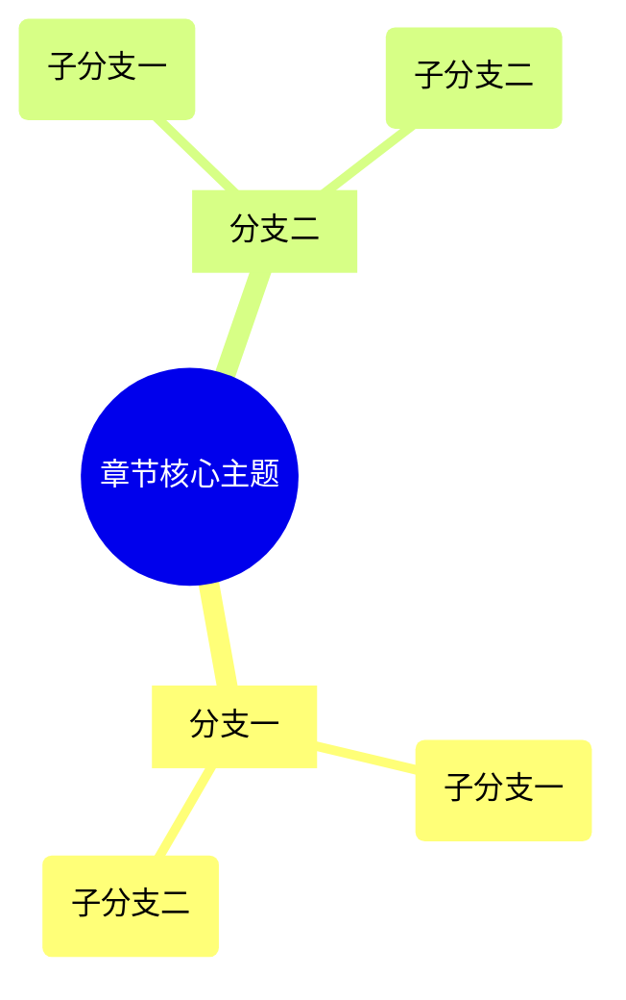
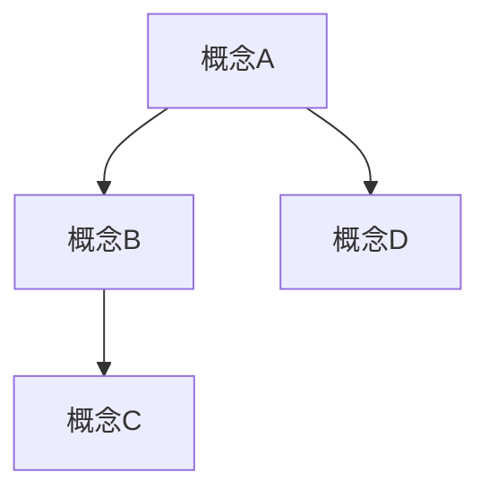

# AI深度分析提示词模板

> 本文件提供多种AI深度分析提示词模板，用于对分章后的书籍内容进行结构化分析。

---

## 使用方法

1. 读取分章后的章节文件内容
2. 选择对应的提示词模板
3. 将章节内容粘贴到 `[章节内容]` 位置
4. 发送给AI进行分析
5. 保存分析结果到章节文件夹

---

## 模板一：章节概述（快速版）

**适用场景**：快速了解章节核心内容

**输出文件**：`01_章节概述.md`

```markdown
请对以下章节内容进行深度分析，生成章节概述：

【要求】
1. 章节主旨：一句话概括本章核心论点
2. 章节概述：200-300字详细阐述内容脉络
3. 核心要点：提炼3-5条核心要点，每条包含标题和简要说明

【章节内容】
[粘贴章节内容]

【输出格式】
## 章节主旨
[一句话概括]

## 章节概述
[200-300字详细阐述]

## 核心要点
1. **要点一**：[说明]
2. **要点二**：[说明]
3. **要点三**：[说明]
```

---

## 模板二：知识要素（概念版）

**适用场景**：提取章节中的知识性内容

**输出文件**：`02_知识要素.md`

```markdown
请对以下章节进行知识要素提取：

【提取内容】
1. 核心概念：识别章节中的关键概念，给出定义和解释
2. 名词定义：专业术语的解释
3. 金句摘录：有价值的原文引用
4. 思想/理论：阐述的理论框架

【章节内容】
[粘贴章节内容]

【输出格式】
## 核心概念
- **概念名称**：[定义和解释，说明其在章节中的作用]
- **概念名称**：[...]

## 名词定义
- **术语**：[定义解释]

## 金句摘录
> "[原文引用内容]" —— [出处/上下文]

## 思想/理论
- **[理论/思想名称]**：[阐述和说明]
```

---

## 模板三：案例分析（故事版）

**适用场景**：分析章节中的案例、事例

**输出文件**：`03_案例分析.md`

```markdown
请对以下章节进行案例分析：

【分析要求】
1. 识别章节中的所有案例/事例
2. 对每个案例分析：背景、要素、过程
3. 说明案例如何印证理论观点
4. 提炼案例的启示意义

【章节内容】
[粘贴章节内容]

【输出格式】
## 案例一：[案例名称/主题]

**案例内容**：
[简要描述案例的具体内容]

**案例分析**：
- 案例背景
- 关键要素
- 发展过程

**理论印证**：
[该案例如何印证或说明本章的理论观点]

**启示意义**：
[案例的价值和启示]

---

## 案例二：[案例名称/主题]
...
```

---

## 模板四：应用拓展（实践版）

**适用场景**：提取可操作的实践方法

**输出文件**：`04_应用拓展.md`

```markdown
请对以下章节进行应用拓展分析：

【分析要求】
1. 提取章节中的实践方法
2. 整理操作步骤
3. 说明行动策略
4. 给出习惯养成建议

【章节内容】
[粘贴章节内容]

【输出格式】
## 实践方法
- **方法名称**：[具体说明如何应用本章知识]

## 操作步骤
1. [步骤一]
2. [步骤二]
3. [步骤三]

## 行动策略
- [策略一：具体说明]
- [策略二：具体说明]

## 习惯养成
- [建议培养的习惯]

## 高级技巧
- [进阶使用方法]
```

---

## 模板五：思维导图（结构版）

**适用场景**：可视化章节结构

**输出文件**：`05_思维导图.md`

```markdown
请对以下章节生成思维导图：

【要求】
1. 提取章节层级结构
2. 用Mermaid语法生成思维导图
3. 展示概念之间的逻辑关系

【章节内容】
[粘贴章节内容]

【输出格式】
## 章节结构



## 逻辑关系



## 核心框架


```

---

## 模板六：知识提问（学习版）

**适用场景**：生成引导性问题促进学习

**输出文件**：`06_知识提问.md`

```markdown
请对以下章节生成知识提问：

【提问设计原则】
- 基础理解：检验对原文内容的掌握程度
- 深度思考：引导分析理论逻辑和概念关联
- 应用反思：促进将知识应用于实际场景
- 拓展探索：激发进一步学习的兴趣

【章节内容】
[粘贴章节内容]

【输出格式】
## 基础理解
1. **[问题一]**？[提示：引导回顾概念定义]

2. **[问题二]**？[提示：引导梳理内容脉络]

## 深度思考
3. **[问题三]**？[提示：引导分析论证过程]

4. **[问题四]**？[提示：引导建立知识联系]

## 应用反思
5. **[问题五]**？[提示：引导联系实际场景]

6. **[问题六]**？[提示：引导质疑和反思]

## 拓展探索
7. **[问题七]**？[提示：引导进一步学习方向]
```

---

## 模板七：完整六维分析（综合版）

**适用场景**：一次性生成完整分析

**输出文件**：`AI深度分析_完整版.md`

```markdown
请对以下章节进行完整的AI深度分析，从六个维度输出结构化总结：

【分析维度】
1. 章节概述 - 主旨、脉络、核心要点
2. 知识要素 - 核心概念、名词定义、金句摘录
3. 案例分析 - 案例内容、分析、理论印证、启示
4. 应用拓展 - 实践方法、操作步骤、行动策略
5. 思维导图 - 章节结构（Mermaid格式）
6. 知识提问 - 基础理解、深度思考、应用反思

【分析原则】
- 基于原文：紧密贴合章节内容，准确引用
- 深度解读：揭示理论逻辑、概念关联、论证结构
- 结构化输出：按指定格式输出，保持清晰

【章节内容】
[粘贴章节内容]

【输出格式】
# [章节标题] - AI深度分析

## 一、章节概述

### 章节主旨
[一句话概括核心论点]

### 章节概述
[200-300字详细阐述：位置作用、逻辑结构、解决路径]

### 核心要点
1. **要点一**：[详细说明]
2. **要点二**：[详细说明]
3. **要点三**：[详细说明]
4. **要点四**：[可选]
5. **要点五**：[可选]

---

## 二、知识要素

### 核心概念
- **概念名称**：[定义和解释，说明作用]
- **概念名称**：[...]

### 名词定义
- **术语**：[定义解释]

### 金句摘录
> "[原文引用]" —— [出处/上下文]

### 思想/理论
- **[理论名称]**：[阐述和说明]

---

## 三、案例分析

### 案例一：[案例名称/主题]

**案例内容**：
[简要描述案例的具体内容]

**案例分析**：
- 案例背景
- 关键要素
- 发展过程

**理论印证**：
[该案例如何印证本章的理论观点]

**启示意义**：
[案例的价值和启示]

---

## 四、应用拓展

### 实践方法
- **方法名称**：[具体说明如何应用本章知识]

### 操作步骤
1. [步骤一]
2. [步骤二]
3. [步骤三]

### 行动策略
- [策略一：具体说明]
- [策略二：具体说明]

---

## 五、思维导图


---

## 六、知识提问

### 基础理解
1. **[问题一]**？[提示：引导回顾概念定义]
2. **[问题二]**？[提示：引导梳理内容脉络]

### 深度思考
3. **[问题三]**？[提示：引导分析论证过程]
4. **[问题四]**？[提示：引导建立知识联系]

### 应用反思
5. **[问题五]**？[提示：引导联系实际场景]
6. **[问题六]**？[提示：引导质疑和反思]

### 拓展探索
7. **[问题七]**？[提示：引导进一步学习方向]
```

---

## 模板八：逐段深度分析（精细版）

**适用场景**：学术研究、精细研读

**输出文件**：`07_逐段分析.md`

```markdown
请对以下章节进行逐段深度分析：

【要求】
1. 将章节按段落拆分
2. 对每个段落进行：
   - 段落摘要：一句话概括段落大意
   - 核心观点：提取关键论点
   - 关键概念：识别重要概念
   - 人物/数据：提取案例人物、实验数据等
   - 论证逻辑：分析段落如何支撑章节主题

【输出格式】
# [章节标题] - 逐段分析

## 段落统计
- 总段落数：X
- 总字数：X

---

## 段落1

**原文**：
[段落原文]

**分析**：
- 段落摘要：[一句话概括]
- 核心观点：[关键论点]
- 关键概念：[重要概念]
- 人物/数据：[案例人物、实验数据]
- 论证逻辑：[如何支撑主题]

---

## 段落2
...

【章节内容】
[粘贴章节内容]
```

---

## 模板九：特定类型书籍分析

### 9.1 理论类书籍（如《资本论》）

```markdown
请对以下理论性章节进行深度分析：

【重点分析】
- 概念定义和理论框架
- 逻辑论证结构
- 理论之间的关联
- 核心命题的推导过程

【输出】
1. 章节概述（核心命题、论证脉络）
2. 概念体系（核心概念、定义、关系）
3. 论证分析（前提、推理、结论）
4. 理论关联（与前后章、全书框架的关系）
5. 批判思考（理论的假设、局限、反驳）

【章节内容】
[粘贴章节内容]
```

### 9.2 实用类书籍（如操作指南）

```markdown
请对以下实用性章节进行深度分析：

【重点分析】
- 操作步骤和方法要点
- 应用场景和条件
- 常见错误和注意事项
- 实践效果和评估标准

【输出】
1. 章节概述（解决的问题、方法概述）
2. 核心方法（步骤、要点、工具）
3. 应用场景（适用情况、不适用情况）
4. 实践指导（操作清单、检查点）
5. 进阶技巧（优化方法、高级应用）

【章节内容】
[粘贴章节内容]
```

### 9.3 叙事类书籍（如历史、传记）

```markdown
请对以下叙事性章节进行深度分析：

【重点分析】
- 事件脉络和时间线
- 人物关系和动机
- 历史背景和影响
- 叙事技巧和视角

【输出】
1. 章节概述（事件概要、叙事重点）
2. 事件分析（时间线、关键节点）
3. 人物分析（主要人物、关系、动机）
4. 历史意义（影响、启示、评价）
5. 叙事技巧（视角、结构、语言）

【章节内容】
[粘贴章节内容]
```

---

## 模板十：对比分析（多章节）

**适用场景**：理解章节之间的关联

**输出文件**：`对比分析.md`

```markdown
请对以下多个章节进行对比分析：

【章节一】
[粘贴章节一内容]

【章节二】
[粘贴章节二内容]

【分析要求】
1. 主题对比：两章的核心主题有何关联？
2. 逻辑递进：两章的论证如何衔接？
3. 概念关联：共同涉及的概念如何发展？
4. 案例对比：案例选择有何异同？
5. 综合理解：两章结合后的完整图景

【输出格式】
## 主题对比
...

## 逻辑递进
...

## 概念关联
...

## 案例对比
...

## 综合理解
...
```

---

## 快速参考表

| 模板 | 适用场景 | 输出文件 | 复杂度 |
|-----|---------|---------|-------|
| 模板一：章节概述 | 快速了解 | `01_章节概述.md` | ⭐⭐ |
| 模板二：知识要素 | 概念提取 | `02_知识要素.md` | ⭐⭐⭐ |
| 模板三：案例分析 | 故事分析 | `03_案例分析.md` | ⭐⭐⭐ |
| 模板四：应用拓展 | 实践指导 | `04_应用拓展.md` | ⭐⭐⭐ |
| 模板五：思维导图 | 结构可视化 | `05_思维导图.md` | ⭐⭐ |
| 模板六：知识提问 | 学习引导 | `06_知识提问.md` | ⭐⭐ |
| 模板七：完整六维 | 全面分析 | `AI深度分析_完整版.md` | ⭐⭐⭐⭐⭐ |
| 模板八：逐段分析 | 精细研读 | `07_逐段分析.md` | ⭐⭐⭐⭐⭐ |
| 模板九：特定类型 | 针对性分析 | 按需生成 | ⭐⭐⭐⭐ |
| 模板十：对比分析 | 跨章关联 | `对比分析.md` | ⭐⭐⭐⭐ |

---

## 使用技巧

### 1. 分段处理长章节
如果章节内容过长（>5000字），建议：
- 分段发送给AI
- 每次处理一个主要部分
- 最后要求AI整合完整分析

### 2. 迭代优化
第一次分析后，可以追加要求：
```
请对第X部分进行更详细的分析，增加：
- 更多原文引用
- 更深入的逻辑分析
- 更多实际应用例子
```

### 3. 保存分析结果
建议将AI生成的分析保存为：
```
章节文件夹/
├── 原始章节.md
├── 01_章节概述.md
├── 02_知识要素.md
├── 03_案例分析.md
├── 04_应用拓展.md
├── 05_思维导图.md
├── 06_知识提问.md
└── 07_逐段分析.md
```

---

## 更新历史

- **2026-05-05**: 创建初始版本，包含10个分析模板
